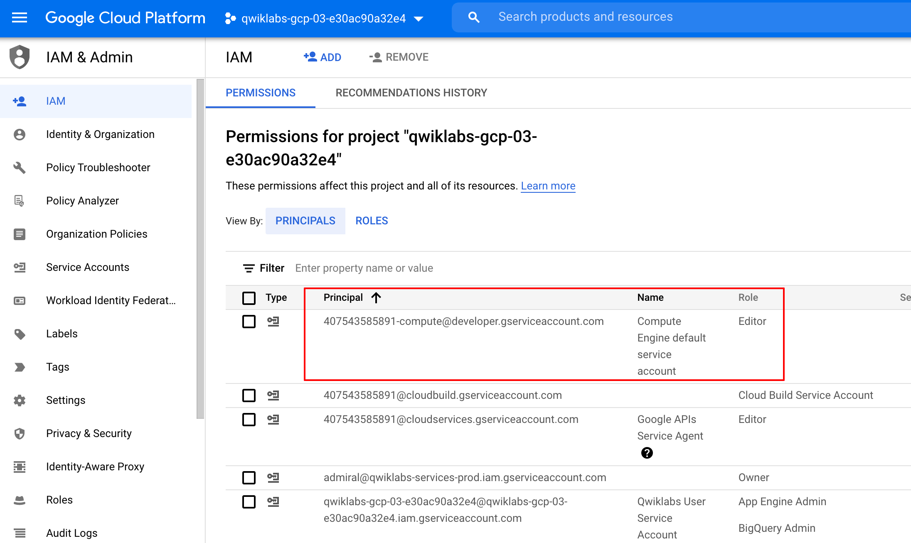

# Streaming Tweets from Data Fusion to BigQuery

## Check project permissions
Before you begin working on Google Cloud, you must ensure that your project has the correct permissions within Identity and Access Management (IAM).

In the Google Cloud console, on the Navigation menu (Navigation menu icon), click IAM & Admin > IAM.

Confirm that the default compute Service Account {project-number}-compute@developer.gserviceaccount.com is present and has the editor role assigned. The account prefix is the project number, which you can find on Navigation menu > Cloud overview.

If the account is not present in IAM or does not have the editor role, follow the steps below to assign the required role.

1. In the Google Cloud console, on the Navigation menu, click Cloud overview.
2. From the Project info card, copy the Project number.



3. On the Navigation menu, click IAM & Admin > IAM.
4. At the top of the IAM page, click Add.

5. For New principals, type:

```{project-number}-compute@developer.gserviceaccount.com```

Replace {project-number} with your project number.

6. For Select a role, select Basic (or Project) > Editor.

7. Click Save.

## Ensure that the Dataflow API is successfully enabled
To ensure access to the necessary API, restart the connection to the Dataflow API.

1. In the Cloud Console, enter "Dataflow API" in the top search bar. Click on the result for Dataflow API.
2. Click Manage.
3. Click Disable API.
4. If asked to confirm, click Disable.
5. Click Enable.

## Load the data
1. First, you need to download the sample tweets, into your computer. You will later upload this using Wrangler to create transformation steps.
You will also need to stage the same sample tweets file in your Cloud Storage bucket. Towards the end of this lab, you will stream the data from your bucket into a Pub/sub topic.

2. In Cloud Shell, execute the following commands to create a new bucket:

``` export BUCKET=$GOOGLE_CLOUD_PROJECT```

```gsutil mb gs://$BUCKET```

3. The created bucket has the same name as your Project ID.

4. Run the below command to copy tweets file into the bucket:

```gsutil cp gs://cloud-training/OCBL164/pubnub_tweets_2019-06-09-05-50_part-r-00000 gs://$BUCKET```

5. Verify that file is copied into your Cloud Storage bucket

## Setting up Pub/Sub Topic
1. To use a Pub/Sub, you create a topic to hold data and a subscription to access data published to the topic.
2. In the Cloud Console, from the Navigation menu click Pub/Sub and then select Topics.
3. Click Create topic.
4. The topic must have a unique name. For this lab, name your topic ```cdf_lab_topic``` in the Create a topic dialog, then click CREATE TOPIC.


## Add a Pub/Sub subscription
1. Still on the topic page. Now you'll make a subscription to access the topic.
2. Click on the Create subscription and then select Create subscription from the drop-down menu.
3. Type a name for the subscription, such as cdf_lab_subscription, set the Delivery Type to Pull, then click Create.


## Add necessary permissions for your Cloud Data Fusion instance
1. Next, you will grant permissions to the service account associated with the instance, using the following steps.
2. In the Cloud Console, from the Navigation menu select Data Fusion > Instances. You should see a Cloud Data Fusion instance already set up and ready for use.
3. Next, you will grant permissions to the service account associated with the instance, using the following steps.
4. Click on the instance name. On the Instance details page copy the Service Account to your clipboard.
5. In the Cloud Console navigate to the IAM & Admin > IAM.
6. On the IAM Permissions page, click Add.
7. In the New Principals field paste the service account.
8. Click into the Role field and start typing Cloud Data Fusion API Service Agent, then select it.
9. Click Save.

## Grant service account user permission
1. In the console, on the Navigation menu, click IAM & admin > IAM.
2. Select the Include Google-provided role grants checkbox.
3. Scroll down the list to find the Google-managed Cloud Data Fusion service account that looks like service-{project-number}@gcp-sa-datafusion.iam.gserviceaccount.com and then copy the service account name to your clipboard.
4. Google-managed Cloud Data Fusion service account listing
5. Next, navigate to the IAM & admin > Service Accounts.
6. Click on the default compute engine account that looks like {project-number}-compute@developer.gserviceaccount.com, and select the Permissions tab on the top navigation.
7. Click on the Grant Access button.
8. In the New Principals field, paste the service account you copied earlier.
9. In the Role dropdown menu, select Service Account User.
10. Click Save.

## Navigate the Cloud Data Fusion UI
When using Cloud Data Fusion, you use both the Cloud Console and the separate Cloud Data Fusion UI. In the Cloud Console, you can create a Cloud Console project, and create and delete Cloud Data Fusion instances. In the Cloud Data Fusion UI, you can use the various pages, such as Pipeline Studio or Wrangler, to use Cloud Data Fusion features.

To navigate the Cloud Data Fusion UI, follow these steps:
1. In the Cloud Console return to Data Fusion, then click the View Instance link next to your Data Fusion instance. Select your lab credentials to sign in. If prompted to take a tour of the service click on No, Thanks. You should now be in the Cloud Data Fusion UI.
2. On the Cloud Data Fusion Control Center, use the Navigation menu to expose the left menu, then choose Wrangler.


## Build a Realtime Pipeline
When working with data it’s handy to be able to see what the raw data looks like so that you can use it as a starting point for your transformation. For this purpose you’ll be using Wrangler for preparing and cleaning data. This data-first approach will allow you to quickly visualize your transformations and the real-time feedback ensures that you’re on the right track.

1. When Wrangler loads, on the left side menu click on Upload.

2. Click on the upload icon to upload the sample tweets file you had earlier downloaded into your computer.

3. The data is loaded into the Wrangler screen in row/column form. It will take a couple of minutes.
Note: Treat this as a sample of the events you will eventually receive in Pub/Sub. This is representative of real-world scenarios, where typically you don’t have access to production data while you develop your pipeline. However, your administrator might give you access to a small sample, or you may be working on mock data that adheres to the contract of an API. In this section, you will apply transformations on this sample iteratively, with feedback at each step. Then you will learn how to replay the transformations on real data.
The first operation is to parse the JSON data into a tabular representation that is split into rows and columns. To do this, you will select the dropdown icon from the first column (body) heading , then select the Parse menu item, and then JSON from the submenu. On the popup, set the Depth as 1, then click Apply.

4. Repeat the previous step to see a more meaningful data structure for further transformation. Click on the body column dropdown icon, then select Parse > JSON and set the Depth as 1, then click Apply.

5. Besides using the UI, you can also write Transformation Steps into the Wrangler directive command line box. This box appears at the lower section of your wrangler UI (look for the command console with the $ prompt in green). You will use the command console to paste a set of Transformation Steps in the next step.

6. Add the Transformation Steps below by copying all and paste them into the Wrangler directive command line box.

```
columns-replace s/^body_payload_//g
drop id_str
parse-as-simple-date :created_at EEE MMM dd HH:mm:ss Z yyyy
drop display_text_range
drop truncated
drop in_reply_to_status_id_str
drop in_reply_to_user_id_str
parse-as-json :user 1
drop coordinates
set-type :place string
drop geo,place,contributors,is_quote_status,favorited,retweeted,filter_level,user_id_str,user_url,user_description,user_translator_type,user_protected,user_verified,user_followers_count,user_friends_count,user_statuses_count,user_favourites_count,user_listed_count,user_is_translator,user_contributors_enabled,user_lang,user_geo_enabled,user_time_zone,user_utc_offset,user_created_at,user_profile_background_color,user_profile_background_image_url,user_profile_background_image_url_https,user_profile_background_tile,user_profile_link_color,user_profile_sidebar_border_color,user_profile_sidebar_fill_color,user_profile_text_color,user_profile_use_background_image
drop user_following,user_default_profile_image,user_follow_request_sent,user_notifications,extended_tweet,quoted_status_id,quoted_status_id_str,quoted_status,quoted_status_permalink
drop user_profile_image_url,user_profile_image_url_https,user_profile_banner_url,user_default_profile,extended_entities
fill-null-or-empty :possibly_sensitive 'false'
set-type :possibly_sensitive boolean
drop :entities
drop :user_location
```

7. If the message appears like 'No data. Try removing some transformation steps.' then remove any one of the transformation step by clicking on X and once the data appears you can proceed further.
8. Next, replay the transformations on actual data. To do so, click Create a Pipeline in Wrangler. Choose Realtime pipeline in the prompt that appears.
9. As you can see, you’re now inside the Pipeline Studio, where a single node has been placed on the canvas, representing the transformations you just defined in Wrangler. However, no source is connected to this pipeline, since as explained above, you applied these transformations on a representative sample of the data on your laptop, and not on data in its actual production location. In the next step, let’s specify where the data will actually be located.
10. From the Source section of the plugin palette, select PubSub. The PubSub source node will appear on the canvas. Open it by clicking the Properties button.

11. Specify the various properties of the PubSub source as below:
    11. Under Reference Name, enter Twitter_Input_Stream
    11. Under Subscription enter cdf_lab_subscription (which is the name of your PubSub subscription you created earlier)
    11. Click Validate to ensure that no errors will be found. 
    11. Click on the X on the top right to close the properties box.

Note: The PubSub source does not accept the fully qualified subscription name, but only its last component after the .../subscriptions/ portion.

12. Now connect the PubSub source node to the Wrangler node that you previously added.

Note:  that since you previously used a sample of the data in Wrangler, the source column appeared as body in Wrangler. However, the PubSub source emits it in a field with the name message. In the next step, you will fix this discrepancy.

13. Open the properties for your Wrangler node and add the following directive at the top of the existing Transformation Steps:

```
keep :message
set-charset :message 'utf-8'
rename :message :body
```

14. Click on the X on the top right to close the properties box.
15. Now that you have connected a source and a transform to the pipeline, complete it by adding a sink. From the Sink section of the left side panel, choose BigQuery. A BigQuery sink node appears on the canvas.
16. Connect the Wrangler node to the BigQuery node by dragging the arrow from the Wrangler node to the BigQuery node. Next, you will configure the BigQuery node properties.
17. Hover over the BigQuery node and click on Properties.
    17. Under Reference Name, enter realtime_pipeline
    17. Under Dataset, enter realtime
    17. Under Table, enter tweets
    17. Click Validate to ensure that no errors will be found.

18. Click on the X on the top right to close the properties box.


19. Click on Name your pipeline , add Realtime_Pipeline as the name, and click Save.

20. Click on Deploy icon and then start the pipeline.

Once deployed, click Run. Wait for the pipeline Status to change to Running. It will take a couple of minutes.


## Send messages into Cloud Pub/Sub
Send events by bulk loading events into the subscription using the Dataflow template.

You will now create a Dataflow job based on template to process multiple messages from the tweets file and publish them onto the earlier created pubsub topic. Use Text Files on Cloud Storage to Pub/Sub under Process Data Continuously (Stream) template from dataflow create job page.

1. Back in the Cloud Console, go to Navigation menu > Dataflow.

2. In the top menu bar, click CREATE JOB FROM TEMPLATE.

3. Enter streaming-pipeline as the Job name for your Cloud Dataflow job.

4. Under Cloud Dataflow template, select Text Files on Cloud Storage to Pub/Sub template

5. Under Input Cloud Storage File(s), enter gs://<YOUR-BUCKET-NAME>/<FILE-NAME> Be sure to replace <YOUR-BUCKET-NAME> with the name of your bucket and <FILE-NAME> with the name of the file which you downloaded earlier into your computer.

For ex: gs://qwiklabs-gcp-01-dfdf34926367/pubnub_tweets_2019-06-09-05-50_part-r-00000

6. Under Output Pub/Sub Topic, enter projects/<PROJECT-ID>/topics/cdf_lab_topic
Be sure to replace PROJECT-ID with your actual Project ID.

7. Under Temporary Location, enter gs://<YOUR-BUCKET-NAME>/tmp/

8. Click the Run job button.

Execute dataflow job and wait for a couple of minutes. You can view messages on pubsub subscription and then view them being processed through real time CDF pipeline.