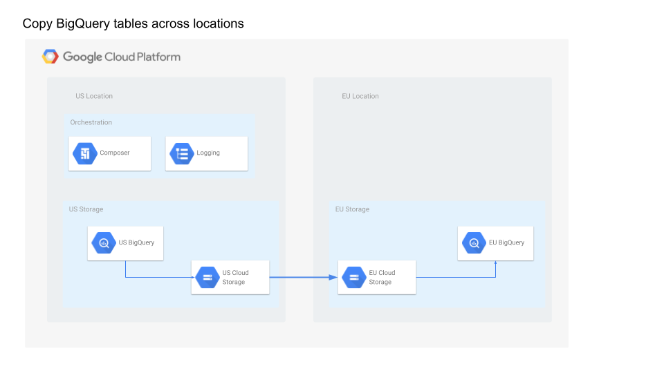
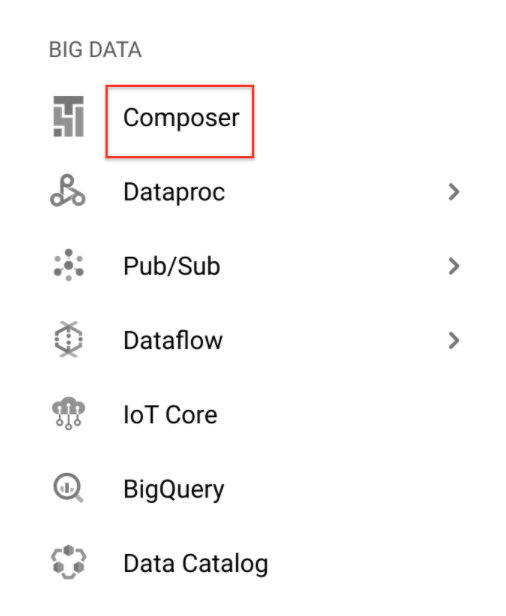
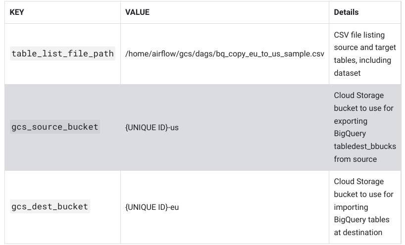
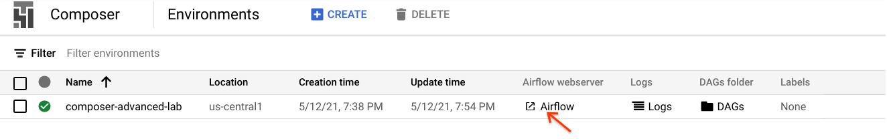
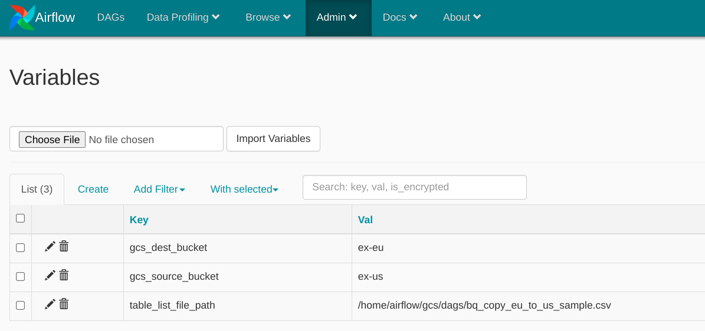
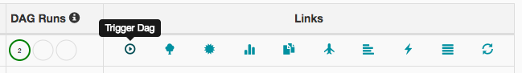
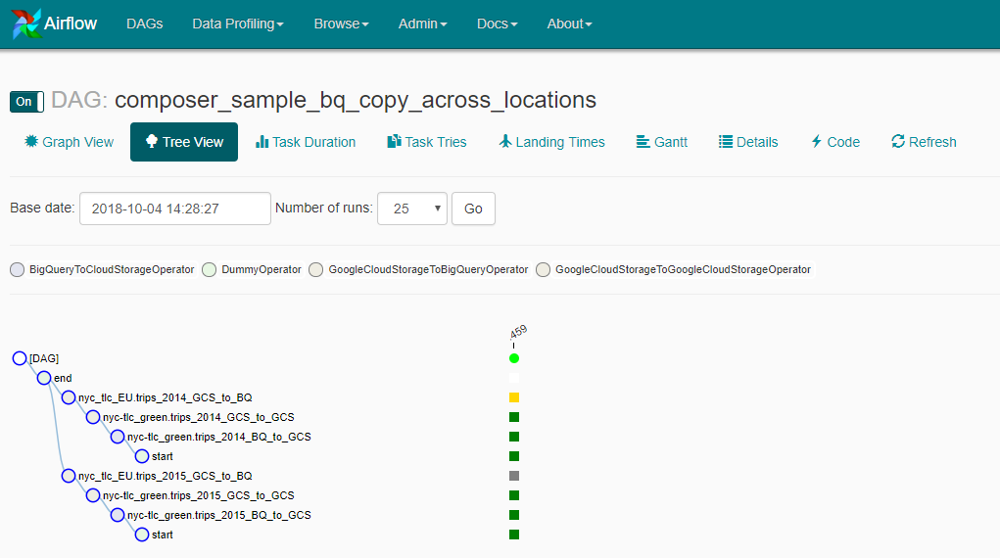

Let's create and run an Apache Airflow workflow in Cloud Composer that completes the following tasks:

* Reads from a config file the list of tables to copy
* Exports the list of tables from a BigQuery dataset located in US to Cloud Storage
* Copies the exported tables from US to EU Cloud Storage buckets
* Imports the list of tables into the target BigQuery Dataset in EU


## Create Cloud Composer environment


Enable the composer api 
```
gcloud services enable composer.googleapis.com
```
Make sure the permission *composer.environments.create* is granted to the relevant service account (default or user created) [reference](https://cloud.google.com/composer/docs/how-to/access-control#about-service)



Create a Cloud Composer environment by clicking on Composer in the Navigation menu:

Then click Create environment. In dropdown menu, select Composer 2 (Autoscaling, Airflow 2)

Set the following parameters for your environment:
```
Name: composer-advanced-lab
Location: us-east1
Zone: us-east1-c
Leave all other settings as default. Click Create.
```

It can take up to 20 minutes for the environment to complete the setup process. Move on to the next section Create Cloud Storage buckets and BigQuery destination dataset

## Create Cloud Storage buckets

Create two Cloud Storage Multi-Regional buckets. Give your two buckets a universally unique name including the location as a suffix:

* one located in the US as source (e.g. 6552634-us)
* the other located in EU as destination (e.g. 6552634-eu)
* These buckets will be used to copy the exported tables across locations, i.e., US to EU.

## BigQuery destination dataset

```
Create the destination BigQuery Dataset in EU from the BigQuery new web UI. 
Click the three dots next to your project ID and select Create dataset:
Use the name **nyc_tlc_EU** and Data location **EU**.
Click CREATE DATASET.
```

## Defining the workflow 

Cloud Composer workflows are comprised of DAGs (Directed Acyclic Graphs). The code shown in **bq_copy_across_locations.py** is the workflow code, also referred to as the DAG. Open the file now to see how it is built. Next will be a detailed look at some of the key components of the file.

To orchestrate all the workflow tasks, the DAG imports the following operators:

```
DummyOperator: Creates Start and End dummy tasks for better visual representation of the DAG.
BigQueryToCloudStorageOperator: Exports BigQuery tables to Cloud Storage buckets using Avro format.
GoogleCloudStorageToGoogleCloudStorageOperator: Copies files across Cloud Storage buckets.
GoogleCloudStorageToBigQueryOperator: Imports tables from Avro files in Cloud Storage bucket.
```

In this example, the function read_master_file() is defined to read the config file and build the list of tables to copy.
The name of the DAG is bq_copy_us_to_eu_01, and the DAG is not scheduled by default so needs to be triggered manually.

## Setting DAGs Cloud Storage bucket

In Cloud Shell, run the following to copy the name of the DAGs bucket from your Environment Details page and set a variable to refer to it in Cloud Shell:
```
DAGS_BUCKET=us-east1-composer-advanc-YOURDAGSBUCKET-bucket
```

## Setting airflow variables

Airflow variables are an Airflow-specific concept that is distinct from environment variables. In this step, you'll set the following three Airflow variables used by the DAG we will deploy: table_list_file_path, gcs_source_bucket, and gcs_dest_bucket.



The next gcloud composer command executes the Airflow CLI sub-command variables. The sub-command passes the arguments to the gcloud command line tool.

To set the three variables, you will run the composer command once for each row from the above table. The form of the command is this:

```
gcloud composer environments run ENVIRONMENT_NAME \
--location LOCATION variables -- \
set KEY VALUE
```


`ENVIRONMENT_NAME` is the name of the environment.
`LOCATION` is the Compute Engine region where the environment is located. The gcloud composer command requires including the `--location` flag or setting the default location before running the gcloud command.
`KEY` and `VALUE` specify the variable and its value to set. Include a space two dashes space ( `--` ) between the left-side gcloud command with gcloud-related arguments and the right-side Airflow sub-command-related arguments. Also include a space between the `KEY` and `VALUE` arguments. using the gcloud composer environments run command with the variables sub-command in:
For example, the **gcs_source_bucket** variable would be set like this:
```
gcloud composer environments run composer-advanced-lab \
--location us-east1 variables -- \
set gcs_source_bucket My_Bucket-us
```
To see the value of a variable, run the Airflow CLI sub-command variables with the get argument or use the Airflow UI.

For example, run the following:

```
gcloud composer environments run composer-advanced-lab \
    --location us-east1 variables -- \
    get gcs_source_bucket
```

## Uploading the DAG and dependencies to Cloud Storage

1. Copy the Google cloud python docs to your cloud storage bucket 

```
cd ~
gsutil -m cp -r gs://spls/gsp283/python-docs-samples .
```

2. Upload a copy of the third party hook and operator to the plugins folder of your Composer DAGs Cloud Storage bucket:
```
gsutil cp -r python-docs-samples/third_party/apache-airflow/plugins/* gs://$DAGS_BUCKET/plugins
```

3. Next, upload the DAG and config file to the DAGs Cloud Storage bucket of your environment:

```
gsutil cp python-docs-samples/composer/workflows/bq_copy_across_locations.py gs://$DAGS_BUCKET/dags
gsutil cp python-docs-samples/composer/workflows/bq_copy_eu_to_us_sample.csv gs://$DAGS_BUCKET/dags
```

Cloud Composer registers the DAG in your Airflow environment automatically, and DAG changes occur within 3-5 minutes. You can see task status in the Airflow web interface and confirm the DAG is not scheduled as per the settings.

## Using the Airflow UI

To access the Airflow web interface using the Cloud Console:

1. Go back to the Composer Environments page.
2. In the Airflow webserver column for the environment, click the Airflow link.



The variables you set earlier are persisted in your environment. You can view the variables by selecting Admin >Variables from the Airflow menu bar.



Click on the DAGs tab and wait for the links to finish loading.
To trigger the DAG manually, click the play button for composer_sample_bq_copy_across_locations :



When you upload your DAG file to the DAGs folder in Cloud Storage, Cloud Composer parses the file. If no errors are found, the name of the workflow appears in the DAG listing, and the workflow is queued to run immediately if the schedule conditions are met, in this case, None as per the settings.

Click the name of the DAG to open the DAG details page. This page includes a graphical representation of workflow tasks and dependencies.




## Validate the results

Check the status and results of the workflow by going to these Cloud Console pages:

The exported tables were copied from the US bucket to the EU Cloud Storage bucket. Click on Cloud Storage to see the intermediate Avro files in the source (US) and destination (EU) buckets.
The list of tables were imported into the target BigQuery Dataset. Click on BigQuery, then click on your project name and the **nyc_tlc_EU** dataset to validate the tables are accessible from the dataset you created.


## Delete Cloud Composer Environment

1. Return to the Environments page in Composer.

2. Select the checkbox next to your Composer environment.

3. Click DELETE.

4. Confirm the pop-up by clicking DELETE again.
