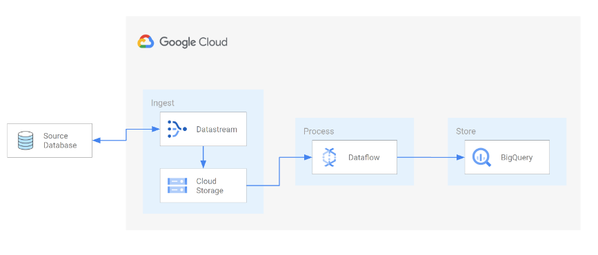

# Datastream - MySQL to BigQuery



Datastream is a serverless and easy-to-use Change Data Capture (CDC) and replication service that allows you to synchronize data across heterogeneous databases, storage systems, and applications reliably and with minimal latency. In this lab you’ll learn how to replicate data changes from your OLTP workloads into BigQuery, in real time. 

In this hands-on lab you’ll deploy the below mentioned resources all at once via terrafrom or individually. Then, you will create and start a Datastream stream, Dataflow job for replication and CDC.

What you’ll do:

- Prepare a MySQL Cloud SQL instance
- Create a GCS bucket to be used in replication/CDC
- Create a Pub/Sub topic, subscription, and a GCS Pub/Sub notification policy
- Create a BigQuery dataset
- Import data into the Cloud SQL instance
- Create a Datastream connection profile referencing the MySQL DB
- Create a Datastream connection profile referencing the GCS destination
- Create a Datastream stream and start replication
- Deploy a Dataflow job to replicate data
- Write Inserts and Updates
- Verify updates in BigQuery


## Git clone repo 

```
git clone https://github.com/AmritRaj23/data-journey/day1.git
cd day-1/datastream
```

## Set-up Cloud Environment

### Initilize your account and project

If you are using the Google Cloud Shell you can skip this step.

```shell
gcloud init
```


